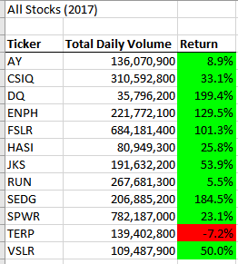

# Automation of Analysis of Stock Data
Automated analysis of 12 stocks to uncover annual trends for investment research.

## Overview of Project

### Purpose
Investors have selected a stock they are interested in without any research. A dataset of daily stock outcomes over 2 years was collected for this stock and 11 others. The stock dataset is summarized by total daily volume and annual percent of return for either of the two years to uncover insights before the final investment decision. 

## Results of Stock Analysis

### Stock Performance Analysis
Overall, stocks had a much higher return in 2017 than 2018. All stocks except RUN and ENPH had negative returns in 2018. 
     
This high level of variability highlights the need for longer and more detailed trend analysis. Future stock performance cannot be known with complete certainty, and the negative returns should be used to illustrate the risk involved in limiting investment to a single stock. 

### Code Performance Analysis
Refactoring the original code resulted in 

## Summary of Methods

### Pros and Cons of Refactoring in General

### Consequences of Refactoring this VBA

### Limitations and Further Analysis

