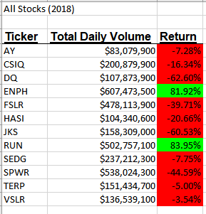
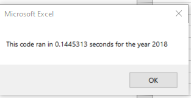

# Automation of Analysis of Stock Data
Automated analysis of 12 stocks to uncover annual trends for investment research.

## Overview of Project

### Purpose
Investors have selected stock DQ without any research. A dataset of daily stock outcomes over 2 years was collected for this stock and 11 others. The stock dataset is summarized by total daily volume and annual percent of return for either of the two years to uncover insights before the final investment decision. 

## Results of Stock Analysis

### Stock Performance Comparison
Overall, stocks had a much higher return in 2017 than 2018. All stocks except RUN and ENPH had negative returns in 2018. DQ performed the best in 2017 at a near 200% return, but had a -63% return the following year. This high level of variability highlights the need for longer and more detailed trend analysis. Future stock performance cannot be known with complete certainty, and the negative returns should be used to illustrate the risk involved in limiting investment to a single stock. 

 

### Code Performance Comparison
Execution times before refactoring the code were near 0.9 seconds. After refactoring the execution times were lowered to about 0.145 seconds. In other words, without refactoring the code takes about 6 times longer than the refactored execution. 

 

## Summary of Methods

### Pros and Cons of Refactoring in General

### Consequences of Refactoring this VBA

### Limitations and Further Analysis

